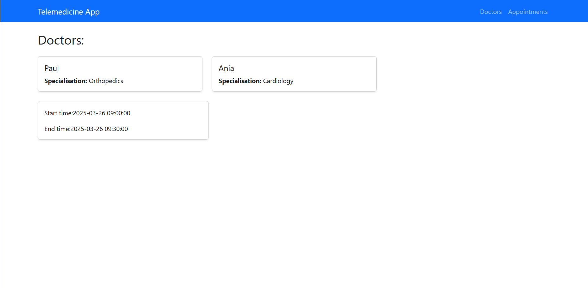
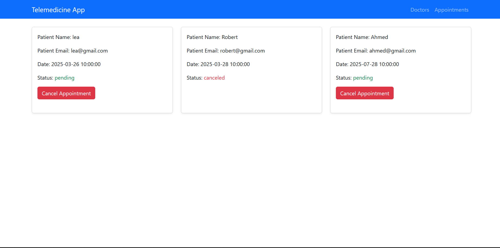

# Telemedicine Appointment Frontend

This project is application built with React. It connects to a Laravel backend `https://github.com/ahmed965/laravel-projects/tree/master/appointment-planning-system`for managing doctor listings, available time slots, and appointments.

## Features

- Doctors list with specialization
- Time slots for the selected doctor
- View and cancel appointments

## Tech Stack

- React
- React Router
- Bootstrap (for styling)

## Getting Started

1. Clone the repository
2. Run `npm install`
3. Start with `npm start`

## App Overview

